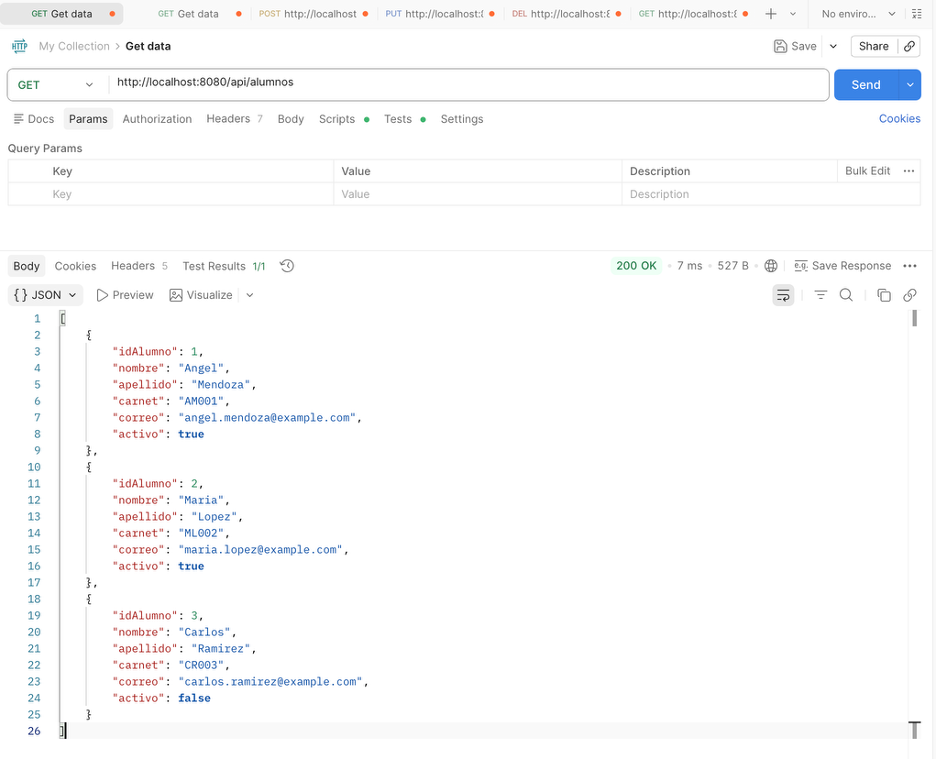
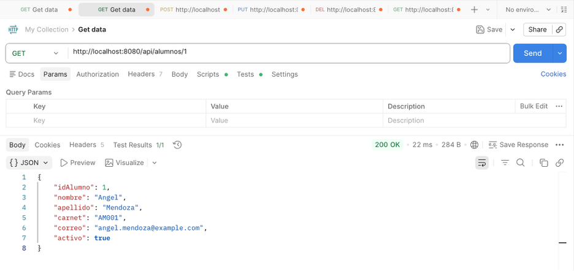
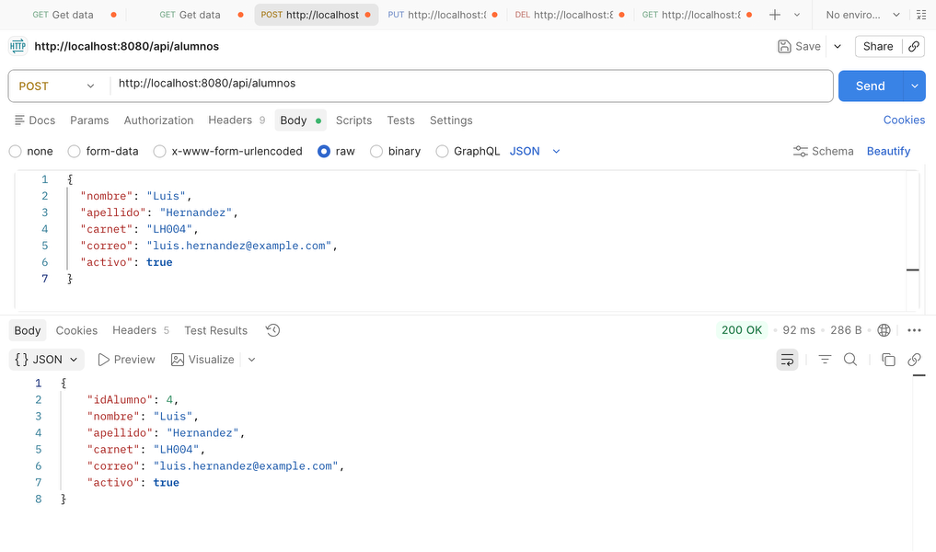
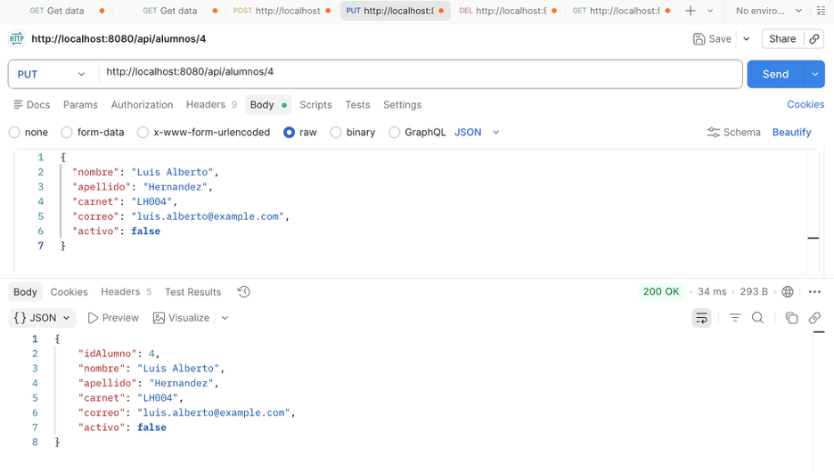
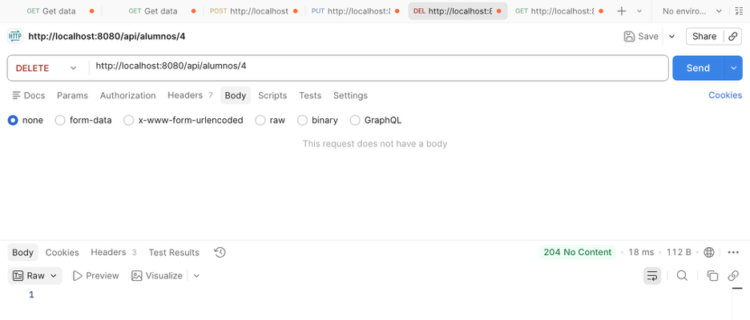
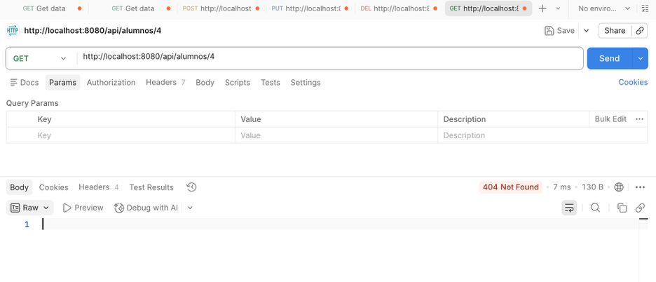

# Parcial Control Académico

## Nombre del alumno
Angel Mendoza

## Nombre del curso
Desarrollo de Software de Avanzada

## Fecha
Viernes 06 de marzo de 2026

## Descripción del proyecto
Este proyecto corresponde al desarrollo de un sistema de control académico. Incluye control de versiones con Git, publicación en GitHub, diseño de base de datos relacional, consultas SQL y documentación del desarrollo.

## Estructura del Proyecto

- `src/main/kotlin/`: código fuente principal de la aplicación Spring Boot.
- `src/main/resources/`: archivos de configuración del proyecto.
- `src/test/kotlin/`: pruebas del proyecto.
- `database/script.sql`: script de creación de base de datos, tablas e inserciones.
- `README.md`: documentación general del proyecto.
- `pom.xml`: archivo de dependencias y configuración de Maven.

## Capturas de Postman ejecutando CRUD

### GET - Obtener todos los alumnos

### GET - Obtener alumno por ID

### POST - Crear alumno

### PUT - Actualizar alumno

### DELETE - Eliminar alumno

### GET - Validación 404 después de eliminar
